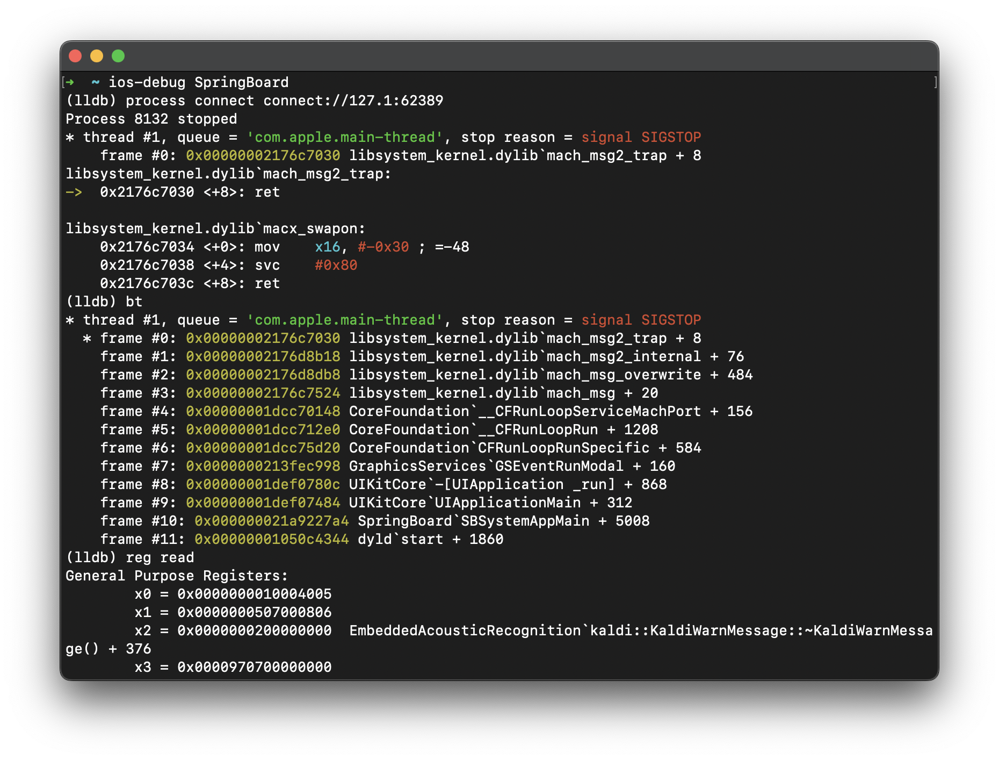

# ios-debug.py

Shortcut to automate your `iproxy`, `debugserver`, `lldb` workflow for research devices.



## Setup

### Prerequisites on host machine

Ensure you have following commands available:

* `ssh`, built-in on macOS
* `iproxy`, `inetcat` from [libusbmuxd](https://github.com/libimobiledevice/libusbmuxd)
* `ideviceinstaller` from [libimobiledevice](https://github.com/libimobiledevice/libimobiledevice)
* `lldb` of course, from either Xcode or `brew install llvm`

### Setup research idevice

* Install OpenSSH

* Set password for `root`

    ```bash
    iPad:~ mobile% sudo passwd
    [sudo] password for mobile:
    Changing password for root.
    ```

### Add ssh configuration

* Add following configuration to `~/.ssh/config` on your host machine

    ```
    Host ios
        StrictHostKeyChecking no
        UserKnownHostsFile /dev/null
        ProxyCommand=inetcat 22
        User mobile
    ```

* Run `ssh-copy-id ios`
* From now, you can simply run `ssh ios` to access your research device
* By adding `--udid` option to inetcat, you can setup multiple aliases for different devices

### Install debugserver on research device

Grab a copy of `debugserver` and save to `/var/root/debugserver` on your research device.

* For iOS < 16, find the DDI image from Xcode.app, usually located at `[XcodeApp]/Contents/Developer/Platforms/iPhoneOS.platform/DeviceSupport/[iOSVersion]/DeveloperDiskImage.dmg`

    Mount the image and find `debugserver` at `/DeveloperDiskImage/usr/bin/debugserver`

* For iOS >= 16, make a copy from your device at path `/usr/libexec/debugserver` (or other location you prefer)

* Push the entitlement xml from this project to your device

    ```bash
    scp entitlements.plist ios:/tmp
    ```

* Resign the binary with `ldid`:

    ```bash
    ldid -S/tmp/entitlements.plist /usr/libexec/debugserver
    ```

### Install a symbolic link on host machine

`sudo ln -s $(pwd)/ios-debug.py /usr/local/bin/ios-debug`

## Usage

`ios-debug -h` for help

* Attach to process by name: `ios-debug SpringBoard`
* If you have more than one device: `ios-debug SpringBoard --udid 1234567890abcdef`
* Attach to process by PID: `ios-debug 1234`
* Debug app by bundle ID: `ios-debug --app com.apple.Preferences`
* Use an alternative debugserver: `ios-debug --server /path/to/debugserver SpringBoard`
